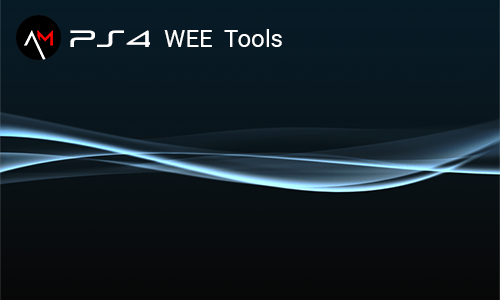

# PS4 Wee Tools

PS4 wee tools is free open source app, that helps to work with PS4 sflash(NOR) / syscon dumps.

Written in Python to keep it simple.

Was tested with Python 3.8

**Dependencies**

If you want to run python script directly you need these libs

(It can be easily installed with help of pip)

`pip install pycryptodome` since v0.7

`pip install pyserial` since v0.8.5

Teensy Loader Application - can be found **[here](https://www.pjrc.com/teensy/loader.html)**

**Documentation**

Visit our [WIKI](https://github.com/andy-man/ps4-wee-tools/wiki)

## Features

**NOR tool**
* PS4 Nor dump info
  * MD5, SKU, Region, SN / Mobo SN, Southbridge, Board ID
  * Torus (WiFi), MAC, HDD, FW (current, minimal), FW2 ver probability
* Flags toggle:
  * boot mode, safe boot, update mode, arcade mode, kiosk mode (idu)
  * registry recovery, manu, button swap, memory budget, slow hdd mode
* System flags cleaning
* Memory clock editing (GDDR5)
* SAMU boot flag edit
* Downgrade by slot switch (FW revert)
* Legitimate CoreOS Patch
* Southbridge patcher
* Torus (WiFi+BT) patcher
* Additional tools
  * Extract NOR's partitions
  * Build dump from extracted files
  * View / Recover NVS areas (1C9, 1CA)
  * View / Recover HDD EAP keys
  * Get HDD EAP keys [keys.bin]
  * EMC CFW for Aeolia
  * Base validation and entropy stats
  * Recovery corrupted partition

**Syscon tool**
* Syscon check
* Debug flag toggle
* Patchable status check
* SNVS blocks viewer (records and flatdata)
* Manual SNVS patch
* Auto SNVS patch (3 modes)
* SNVS rebuilding
* Boot mode selection

**Common**
* File browser
* Batch file rename (extract dump info to filename)
* Terminal (UART) with highlighting
* SPIway flasher
* Syscon r/w tool by Abkarino
* Syscon reader by DarkNESmonk
* Multy files compare
* Pack / Unpack 2BLS files

Don't use if you don't understand what is it for!

## Credits

[Abkarino](https://github.com/AbkarinoMHM), 
[zecoxao](https://github.com/zecoxao), 
[Al-Azif](https://github.com/Al-Azif), 
[Judges](https://github.com/hjudges), 
[pearlxcore](https://github.com/pearlxcore), 
[fail0verflow](https://github.com/fail0verflow), 
[MSX-Celulares](https://github.com/MSXCelulares), 
DarkNESmonk, 
BwE

And of course [PSDevWiki](https://www.psdevwiki.com/ps4/)

## Donate

* **[Patreon](https://patreon.com/andy_man)**
* **[Boosty](https://boosty.to/andy_man/donate)**
* **[YandexMoney](https://yoomoney.ru/to/410011555252085)**
* **Bitcoin**: 39VaMnFqCQo751mvDc3M7ADVty71q2tWDm 
* **TronLink**: TSYe254HXFapEwAAbZFkTHGewezZmnCKnU

## Links

* [X/Twitter](https://twitter.com/AndyManDev)

## Changelog

### v0.9.9
* 11.02 support

### v0.9.8
* NVS areas recovery
* More info for validation

### v0.9.7
* Lang optimization
* Flag: resolution
* UART bugfix
* Assets update
* Root path bugfix (for exe)

### v0.9.5
* Quick/Expert mode for partition recovery
* Southbridge patcher
* Torus (WiFi+BT) patcher
* Util lib update

### v0.9.4
* Partition analyze and recovery
* Flags: active slot
* Code optimization

### v0.9.3
* SCFlasher: Safe syscon erase
* NOR: quick legitimate patch (drag&drop 2 dumps on run.bat)
* SC: "full" clean
* SC: autopatch now works with any* syscon
* SC: Method B bugfix
* SC: manual patch now works with flatdata
* SC: shows line counter
* utils bugfix

### v0.9.0
* Syscon Flasher
* Legitimate CoreOS Patch
* Terminal: title shows rx/tx bytes, show hidden bytes (switch), log to file
* Syscon tool: Added FW md5 check, patchable status bugfix
* Batch rename (extract dump info to filename)
* Code optimization
* Some bugfixes

### v0.8.9
* SPIway bug fix
* Mobo detecting update
* Quick slot switch (jump to spiway)

### v0.8.8
* SPIway flasher
* Flags toggler update (uart second offset)
* Minor bug fixes

### v0.8.7
* New md5 hashes (11.00)
* Board_id info

### v0.8.6
* EMC cmd mode

### v0.8.5
* UART terminal with syntax highlighting
* Integrated syscon reader (Arduino Nano V3)
* Preps for integrated flasher (SPIway & syscon)
* Accurate syscon patch and check
* Syscon boot mode selection
* Syscon flatdata viewer
* FW 10.70 md5
* bug fixes

### v0.8
* SNVS rebuilding (Syscon)
* Manual syscon patch allows to remove entire block
* Tips for syscon patching
* Extra syscon patch (stuck on FW update)
* NVStorage class improvements

### v0.7.9
* EAP key recovery
* Some optimization

### v0.7.8
* Added 6 patterns to slot switcher
* EMC CFW patcher for Aeolia
* UI bugs fixed

### v0.7.7
* SLB2 pack / unpack
* File selection screen upgrade
* Preparations for EMC cfw (Aeolia)

### v0.7.6
* FW2 version assumption
* Validation screen update

### v0.7.5
* Base validation (header, mbrs, emc, eap, wifi)
* Southbridge and torus Info
* Code refactoring
* Minor bugs fix

### v0.7
* Extract NOR's partitions
* Build dump from extracted files
* Get HDD EAP keys [keys.bin]
* File selection screen fix

### v0.6
* Now with color highlighting
* Dialog improvements

### v0.5
* New screen "Flags toggle"
* boot mode, safe boot, update mode, arcade mode, kiosk mode (idu)
* registry recovery, manu, button swap, memory budget, slow hdd mode
* Syscon auto SNVS patch (4 modes)
* New FW detection (experemental)
* Region info
* Minor improvements

### v0.4
* Syscon patchable check
* Manual patch bug fix
* Minor errors fix

### v0.3
* NOR Entropy stats
* Syscon manual patch
* Minor errors fix

### v0.2
* Syscon DEBUG toggle
* Syscon NVStorage class
* Syscon show active slot

### v0.1
* Files compare
* UART, Memtest toggle
* Sys flags clean
* Edit mem clock and SAMU
* Downgrade switch patterns
* Syscon base check
