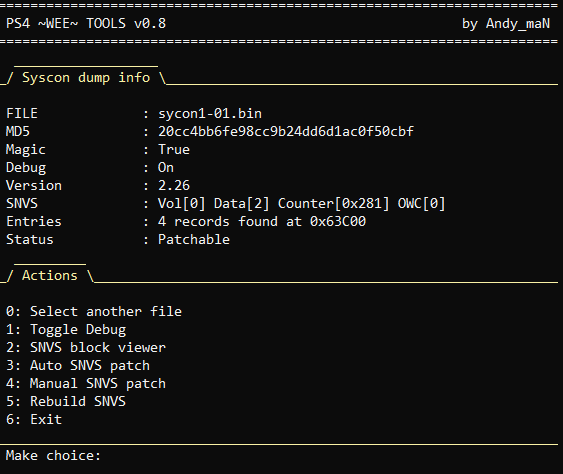

# PS4 Wee Tools

PS4 wee tools help to work with PS4 nor and syscon dumps.

It is free open source alternative for BwE's commercial apps.

Written in Python to keep it simple.

| Nor tool | Syscon tool |
| --- | --- |
|  |  |

Was tested with Python 3.8

Since v0.7 **"Crypto"** library is required if you want to run python script directly

It can be easily installed with help of pip

`pip install crypto`

## Features

NOR tool
* PS4 Nor dump info
  * MD5, SKU, Region, SN / Mobo SN, Southbridge
  * Torus (WiFi), MAC, HDD, FW (current, minimal), FW2 ver probability
* Flags toggle:
  * boot mode, safe boot, update mode, arcade mode, kiosk mode (idu)
  * registry recovery, manu, button swap, memory budget, slow hdd mode
* System flags cleaning
* Memory clock editing (GDDR5)
* SAMU boot flag edit
* Downgrade by slot switch (FW revert)
* Additional tools
  * Extract NOR's partitions
  * Build dump from extracted files
  * View / Recover HDD EAP keys
  * Get HDD EAP keys [keys.bin]
  * Base validation and entropy stats
  * EMC CFW for Aeolia

Syscon tool
* Syscon check
* Patchable status check
* SNVS blocks viewer (records and flatdata)
* Manual SNVS patch
* Auto SNVS patch (3 modes)
* SNVS rebuilding
* Boot mode selection

Common
* Multy files compare
* Pack / Unpack 2BLS files

Don't use if you don't understant what is it for!

## Credits

* fail0verflow
* zecoxao
* Al-Azif
* Darknesmonk
* BwE
* pearlxcore

And of course [PSDevWiki](https://www.psdevwiki.com/ps4/)

## Donate

* **[Patreon](https://patreon.com/andy_man)**
* **[Boosty](https://boosty.to/andy_man/donate)**
* **[YandexMoney](https://yoomoney.ru/to/410011555252085)**
* **Bitcoin**: 39VaMnFqCQo751mvDc3M7ADVty71q2tWDm 

## Links

* [Twitter](https://twitter.com/AndyManDev)

## Changelog

### v0.8
* SNVS rebuilding (Syscon)
* Manual syscon patch allows to remove entire block
* Tips for syscon patching
* Extra syscon patch (stuck on FW update)
* NVStorage class improvements

### v0.7.9
* EAP key recovery
* Some optimization

### v0.7.8
* Added 6 patterns to slot switcher
* EMC CFW patcher for Aeolia
* UI bugs fixed

### v0.7.7
* SLB2 pack / unpack
* File selection screen upgrade
* Preparations for EMC cfw (Aeolia)

### v0.7.6
* FW2 version assumption
* Validation screen update

### v0.7.5
* Base validation (header, mbrs, emc, eap, wifi)
* Southbridge and torus Info
* Code refactoring
* Minor bugs fix

### v0.7
* Extract NOR's partitions
* Build dump from extracted files
* Get HDD EAP keys [keys.bin]
* File selection screen fix

### v0.6
* Now with color highlighting
* Dialog improvements

### v0.5
* New screen "Flags toggle"
* boot mode, safe boot, update mode, arcade mode, kiosk mode (idu)
* registry recovery, manu, button swap, memory budget, slow hdd mode
* Syscon auto SNVS patch (4 modes)
* New FW detection (experemental)
* Region info
* Minor improvements

### v0.4
* Syscon patchable check
* Manual patch bug fix
* Minor errors fix

### v0.3
* NOR Entropy stats
* Syscon manual patch
* Minor errors fix

### v0.2
* Syscon DEBUG toggle
* Syscon NVStorage class
* Syscon show active slot

### v0.1
* Files compare
* UART, Memtest toggle
* Sys flags clean
* Edit mem clock and SAMU
* Downgrade switch patterns
* Syscon base check
